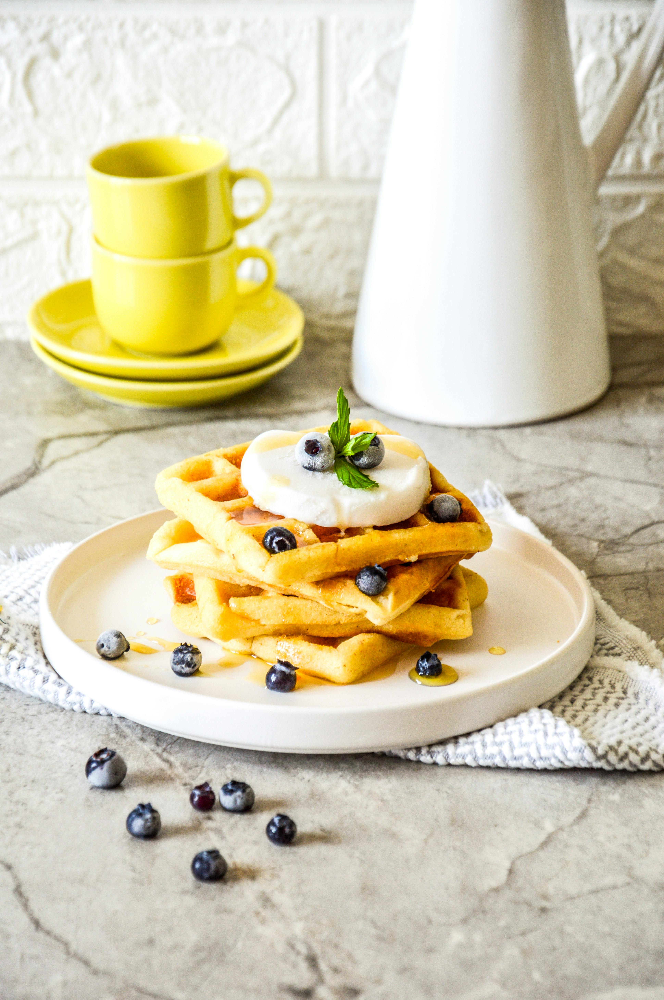

[](README-zh.md)

This plugin supports reading images from local file paths or URLs. Before uploading the image, it compresses and **converts the image to AVIF format**, ensuring image quality while **significantly reducing the image size**. The plugin supports both PicGO CLI and GUI modes.

## Installation
### CLI Mode
```bash
picgo add avif
```
Usage:
```bash
picgo use plugins
```

### PicGo GUI
Directly search for `avif` in the "Plugin Settings" within the software and install it.

## About AVIF
AVIF is a modern image format that leverages AV1 video encoding technology, providing higher compression rates compared to JPEG, PNG, and WebP. AVIF supports both lossy and lossless compression and offers better color depth and transparency support. 

Compared to WebP, AVIF has two notable features:
- Higher compression rate
- Slower encoding speed

As of the creation of this project (September 2024), AVIF’s compatibility is still catching up to WebP but is gradually improving. As seen on [caniuse](https://caniuse.com/avif), only Internet Explorer does not support AVIF. 
**AVIF is highly suitable for web distribution, significantly reducing storage and transmission costs, lowering CDN expenses while improving load speed**. As a high-quality image format, AVIF is gradually replacing other formats and becoming mainstream. Companies like Netflix, JD.com, and Bilibili have already started using AVIF.

The table below shows a comparison of file sizes and visual effects for different image formats at the same resolution, color depth, and DPI:

| Image Format | Image Size | Image File |
| ------------ | ---------- | ---------- |
| JPG          | 1,623KB    |  |
| AVIF         | 431KB      |  |
| PNG          | 6,193KB    |  |
| AVIF         | 80KB       |  |

To promote the use of this high-quality image format, this project has created an AVIF plugin for PicGo.

## Open Source Contribution
We welcome contributions and suggestions for improvement.

## Acknowledgments
This project thanks the following open-source libraries and tools:
- [sharp](https://github.com/lovell/sharp)

## License
This project is licensed under the MIT License.

